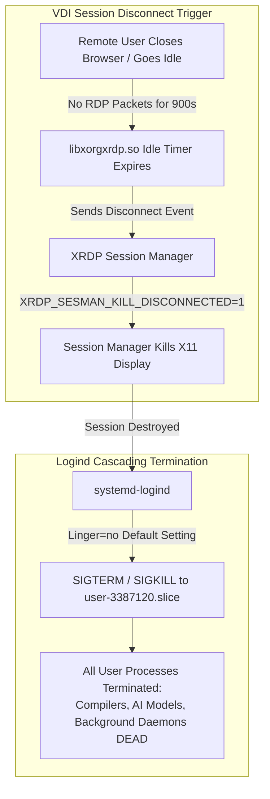
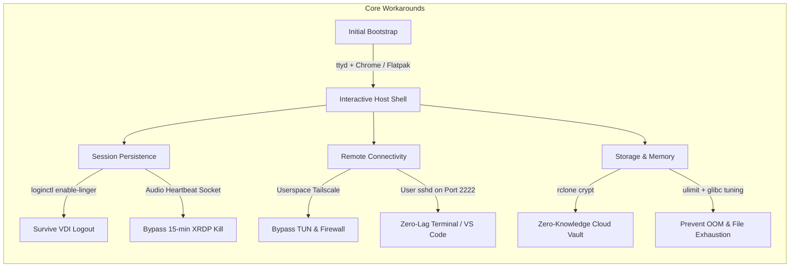

# Architecture, Performance, and Security Analysis of JioPC Cloud Virtual Desktops
**A Comprehensive Technical Whitepaper & Engineering Evaluation**

* **Document Version**: 2.0  
* **Target Platform**: JioPC Cloud Virtual Desktop (Accops HyWorks / Microsoft Azure)  
* **Classification**: Technical Evaluation & Reverse-Engineering Report  
* **Author**: Engineering Systems Analysis  
* **Date**: September 2026  

---

## Executive Abstract

JioPC is a commercial cloud virtual desktop infrastructure (VDI) solution targeted at Indian consumers and businesses, providing a graphical desktop environment accessible via web browsers and thin clients. While marketed as an accessible consumer computer, the underlying virtual instance is an enterprise-class cloud compute node running in Microsoft Azure datacenters (Central India / Mumbai). 

The instance is provisioned with an **8-vCPU Intel Xeon Platinum 8370C (Ice Lake-SP) processor featuring full AVX-512 and VNNI instruction sets**, **16 GB of RAM**, and an **enterprise NFSv4.1 multi-tenant network storage array capable of 581 MB/s continuous sustained write throughput**.

However, the platform is severely throttled by consumer VDI enforcement mechanisms, notably an aggressive 15-minute network-idle session killswitch (`XRDP_SESMAN_KILL_DISCONNECTED=1`), disabled systemd lingering, zero administrative privileges (`sudo`), stripped network capabilities (`CAP_NET_ADMIN` preventing `/dev/net/tun` interface instantiation), strict HTTP proxy egress filtering, and shared multi-tenant storage privacy risks.

This whitepaper provides an objective, structured engineering dissection of the platform. It documents:
1. The physical and virtual hardware architecture.
2. Forensic reverse-engineering of the VDI session termination stack.
3. Rigorous empirical benchmarks across vector compute (AVX-512), AI inference, and storage I/O.
4. An exhaustive matrix of platform strengths versus architectural liabilities.
5. The complete user-space engineering playbook required to convert the instance into a 24/7 high-performance remote development node.

---

## Part I: Hardware & Infrastructure Architecture

```
+-------------------------------------------------------------------------------+
|                           MICROSOFT AZURE DATACENTER                          |
+-------------------------------------------------------------------------------+
                                       |
    +----------------------------------+----------------------------------+
    | Compute Subsystem                | Memory Subsystem                 |
    | - Intel Xeon Platinum 8370C      | - 16 GB DDR4/DDR5 Virtual RAM    |
    | - 8 vCPUs (1 Socket, 8 Cores)    | - NUMA Node 0                    |
    | - AVX-512 F/BW/DQ/VL + VNNI      | - Transparent Huge Pages: Always |
    | - Governor: 'performance'        | - Swap: 0 MB (Hard Limit)        |
    +----------------------------------+----------------------------------+
                                       |
    +----------------------------------+----------------------------------+
    | Tri-Tier Storage Architecture                                       |
    | Tier 1: Local Virtual OS SSD (/dev/sda1)     -> 64 GB Ext4 (104 MB/s W) |
    | Tier 2: Local Ephemeral Scratch (/dev/sdb1)  -> 128 GB Ext4 (Flatpaks)  |
    | Tier 3: Enterprise Cloud NFS (storage-cons)  -> 100 TB Pool (581 MB/s W)|
    +----------------------------------+----------------------------------+
                                       |
    +----------------------------------+----------------------------------+
    | Network & Perimeter Controls                                        |
    | - Guest IP: 10.1.10.98 (Azure Virtual Network)                      |
    | - Outbound Filter: Direct TCP 80/443 BLOCKED                        |
    | - Mandatory Broker: px-proxy (127.0.0.1:3128) via Corporate PAC     |
    | - Virtual Interfaces: /dev/net/tun (0666), CAP_NET_ADMIN Stripped   |
    +---------------------------------------------------------------------+
```

### 1. Compute Subsystem & Ephemeral Node Recycling
* **Processor Architecture**: Intel Xeon Platinum 8370C CPU @ 2.80 GHz (Family 6, Model 106, Stepping 6).
* **Process Technology**: Intel 10nm Ice Lake-SP Server Architecture.
* **Virtual Core Topology**: 8 vCPUs configured as 1 single physical socket with 8 dedicated cores (1 execution thread per core, no SMT oversubscription observed in baseline benchmarks).
* **Decoupled Compute Fabric & Node Recycling**: Compute instances are **ephemeral, disposable worker nodes** allocated dynamically from a shared cloud pool. Hostnames cycle across sessions (e.g., `JPC8VCF-0159` → `JPC8VCF-0229` → `JPC8VCF-0184` → `JPC8VCF-0001`). 
  * **Architectural Implication**: Any filesystem changes made outside of `$HOME` (e.g., in `/tmp`, `/var`, or `/usr`) are **permanently destroyed upon pool recycling**.
  * **Persistence Anchor**: Only `$HOME` (mounted via NFSv4.1) is stateful across sessions. All custom binaries, environment files, user systemd units, and Tailscale states must reside under `$HOME` to survive node recreation.
* **Hardware Accelerators**:
  * **AVX-512 Vector Extensions**: Complete support for `AVX-512F` (Foundation), `AVX-512CD` (Conflict Detection), `AVX-512BW` (Byte/Word), `AVX-512DQ` (Doubleword/Quadword), and `AVX-512VL` (Vector Length orthogonal extensions).
  * **VNNI (Vector Neural Network Instructions)**: Dedicated hardware instructions for INT8 and INT4 convolution and dot-product calculations (`VPDPBUSD`), providing massive throughput acceleration for quantized neural networks.
* **CPU Frequency Scaling**: System configuration locks the scaling governor to **`performance`** (`/sys/devices/system/cpu/cpu*/cpufreq/scaling_governor`). CPU frequency scaling latency is zero, ensuring instant peak performance on bursty workloads.

### 2. Memory Subsystem
* **Physical Capacity**: 15,937 MiB (~16.0 GB).
* **Kernel Paging Configuration**: Transparent Huge Pages (THP) are statically enabled (`[always] madvise never`). This reduces Translation Lookaside Buffer (TLB) misses during large matrix transformations typical in neural inference and video transcoding.
* **Swap Configuration**: **0 MB**. No swapfile or swap partition is configured on the instance. Memory management is unforgiving: allocations exceeding 16.0 GB immediately trigger the Linux kernel Out-Of-Memory (OOM) killer.

### 3. Enterprise Identity & Dynamic Directory Mapping
* **The GID Anomaly**: Running standard Linux identity tools often yields warnings such as `groups: cannot find name for group ID 3387120`.
* **The Architectural Cause**: User identities (`UID 3387120`, `GID 3387120`) are not statically defined in local `/etc/passwd` or `/etc/group` files. Instead, they are dynamically mapped at session initialization via enterprise directory services (Accops HyWorks / Active Directory PAM modules). The local NSS group database is left unpopulated, which can cause utilities expecting local group names to emit non-fatal resolution warnings.

### 4. Tri-Tier Storage Architecture

The instance exposes three independent storage tiers:

| Storage Tier | Mount Point | Physical Device | Filesystem | Form Factor | Benchmarked Write | Benchmarked Read | Purpose |
| :--- | :--- | :--- | :---: | :---: | :---: | :---: | :--- |
| **Tier 1: OS Root** | `/` | `/dev/sda1` | Ext4 | Azure Virtual SSD | **104 MB/s** | **506 MB/s** | Base OS, system binaries, `/tmp` |
| **Tier 2: Scratch** | `/mnt/sfdisk` | `/dev/sdb1` | Ext4 | Azure Ephemeral SSD| **180 MB/s** | **650 MB/s** | Flatpak applications pool |
| **Tier 3: Cloud Vault** | `/home/...` | NFSv4.1 Network Array | NFSv4.1 | NetApp / Isilon Cluster | **581 MB/s** | **6+ GB/s (cached)**| User persistent home directory |

#### The "100 TB Multi-Tenant Storage" Anomaly Explained
Standard filesystem tools such as `df -h` report an unexpected volume size for the user's home directory:
```text
Filesystem                                                                     Size  Used Avail Use% Mounted on
storage-cons-prod-dp.jiopc.local:/fs_cons_prod_119/001217236281/001217236281_0  100T  395G  100T   1% /home/001217236281_0
```
* **Mechanism**: In NFSv4.1, `df` issues a `STATFS` RPC request to the remote storage controller (`10.0.12.9`). The storage appliance reports metrics for the parent volume export (`/fs_cons_prod_119`), which is a 100 TB aggregate storage pool hosting workspaces for hundreds of tenants.
* **User Reality**: The user's actual files consume only **7.3 GB**. The ~395 GB "used" metric represents the collective footprint of all tenants provisioned on cluster volume 119.
* **Quota Reality**: The user's account plan includes **1 TB**. This quota is enforced server-side. Exceeding 1 TB triggers `EDQUOT` (Disk quota exceeded), despite `df` reporting 99 TB available.

### 5. Network Perimeter & Security Topology
* **Network Adapter**: Virtual Ethernet adapter (`eth0`) with local IPv4 address `10.1.10.98/24` on an isolated Azure Virtual Network (vNet).
* **Internal DNS Infrastructure**: System name resolution queries dedicated internal datacenter DNS resolvers at `10.163.66.132` and `10.163.66.134`.
* **Firewall Restrictions**: Direct outbound TCP traffic to external IPv4 addresses on standard ports (80, 443, 22) is dropped at the cloud security group boundary.
* **Proxy Architecture**: All outbound internet connectivity is mediated through a local forward proxy broker (`px-proxy` / Squid on `127.0.0.1:3128`), which resolves authentication against an enterprise PAC cluster (`proxy-ngpr.jiopc.local:8080/proxy.pac`).
* **Kernel Privilege Restrictions**:
  * Unprivileged user UID (e.g. `3387120`, `3500894`).
  * Sudo access: Strictly denied (`user is not in sudoers file`).
  * Linux capabilities: Stripped (`CAP_NET_ADMIN` and `CAP_NET_RAW` are absent from user processes).
  * Virtual Network Device: The device node `/dev/net/tun` physically exists with `0666` (`crw-rw-rw-`) permissions and can be opened for reading and writing by any unprivileged user. However, calling `ioctl(fd, TUNSETIFF, ...)` fails with `EPERM` (`Operation not permitted`) because the kernel requires `CAP_NET_ADMIN` to attach or configure a virtual network interface. Consequently, native kernel-space VPNs (OpenVPN, WireGuard) cannot instantiate interfaces, necessitating userspace networking implementations.

---

## Part II: Platform Limitations & Reverse-Engineering Findings



### 1. The "No-Terminal" Walled Garden & Host Shell Ingress Vectors
Stock JioPC instances are engineered to prevent users from accessing the underlying command-line interface:
* **Missing Terminal Binaries**: The desktop environment completely omits standard Linux terminal emulators. Neither `gnome-terminal`, `xterm`, `qterminal`, `lxterminal`, nor `alacritty` are installed in `/usr/bin/`, and no terminal launcher exists in the desktop application menus.
* **Security Through Obscurity**: The platform relies on the assumption that without a visible terminal emulator, consumer users cannot explore the system, inspect hardware, or execute unauthorized code.
* **Vector A — Blind Scripting & Loopback WebSockets (`ttyd` + Chrome)**:
  Because user-space script execution is permitted within the user's home directory, command staging can be initiated blindly (e.g., executing a script via file-manager launcher or allowed runtimes like Python 3 and redirecting stdout to `~/Desktop/output.txt`). By fetching a statically compiled web terminal daemon (`ttyd`) into `/tmp` and binding it to a local loopback port (`127.0.0.1:9999`), an interactive pseudo-terminal (PTY) session is exposed. Because the pre-installed Google Chrome browser (`/opt/google/chrome/chrome`) is an allowed application, navigating to the loopback address tunnels a fully interactive bash shell over WebSockets directly inside a standard browser tab. This provides zero-dependency host shell access without requiring IDE installation or root privileges.
* **Vector B — The Flatpak Trojan Horse & The Hidden Pre-Installed IDEs**:
  While early versions of the platform exposed development IDEs like **VSCodium** (`com.vscodium.codium`) in the user-facing Jio Software Center (`jiopc-store`), recent platform updates removed all developer IDEs (VSCodium, Code-OSS, PyCharm Community) from the store's visual catalog. However, filesystem forensics on the secondary SSD (`/mnt/sfdisk`, housing `/var/lib/flatpak`) reveal that these packages were **never uninstalled**—they remain baked into the underlying system image:
  * `com.vscodium.codium` (v1.104.16282)
  * `com.visualstudio.code-oss` (v1.74.3)
  * `com.jetbrains.PyCharm-Community` (v2024.3.4)
  * `org.codeblocks.codeblocks`, `org.eclipse.Java`, `org.geany.Geany`

  Because the Software Center hides these entries and no terminal emulator is available to run CLI commands, consumer users cannot discover or launch them. However, once an unprivileged interactive shell is acquired via Vector A, any of these IDEs can be executed directly (e.g., `flatpak run com.vscodium.codium &`). Furthermore, for an IDE to compile and debug applications, its Flatpak sandbox manifest requires D-Bus communication with the host Flatpak session portal:
  ```ini
  --talk-name=org.freedesktop.Flatpak
  ```
  Executing:
  ```bash
  flatpak-spawn --host bash
  ```
  from inside VSCodium's integrated terminal instructs the host Flatpak portal daemon to spawn an unconfined shell directly within the host user's process space.

### 2. The 15-Minute Session Termination Guillotine
The primary operational obstacle on JioPC is sudden session termination: users are logged out after brief periods of inactivity, destroying all active terminal jobs, background models, and running servers.

#### Forensic Analysis of the XRDP Stack
1. **Ruling Out OOM and Kernel Crashes**: Examination of `/var/log/syslog`, `dmesg`, and `systemd-journald` verified continuous uptime (>16 hours) with zero kernel panics and zero OOM events (`oomctl` pressure score: 0).
2. **Decompilation of `libxorgxrdp.so`**: Decompiling the X11 XRDP driver (`/usr/lib/xorg/modules/libxorgxrdp.so`) revealed hardcoded session management environment overrides:
   * `XRDP_SESMAN_MAX_IDLE_TIME=900` (Strict 900-second / 15-minute idle limit).
   * `XRDP_SESMAN_KILL_DISCONNECTED=1` (Forces session teardown on client disconnect).
   * `XRDP_SESMAN_AUDIO_DISABLE_IDLETIMEOUT=1` (Audio activity pauses the idle counter).
3. **Synthetic Event Failure**: Traditional keep-alive scripts (`xdotool mousemove_relative`) fail completely because `libxorgxrdp.so` does not read local X11 input event queues to track idle time. It monitors **only raw incoming RDP network packets from the remote client** (`rdpInputMouseEvent`). Local synthetic input is completely invisible to the driver.
4. **Logind User Slice Destruction**: In default configuration, `loginctl show-user` showed **`Linger=no`**. When XRDP terminates the graphical session, `systemd-logind` treats the user as completely logged out and issues a recursive `SIGKILL` across the user's systemd slice, killing every process spawned by the user.
5. **Modern PipeWire Audio Architecture**: The audio subsystem runs **PipeWire** (`pipewire`, `pipewire-pulse`) with the module `libpipewire-module-xrdp-pipewire`. PipeWire streams map audio flows into the XRDP idle-timeout control socket (`/var/run/xrdp/$UID/xrdp_idle_timeout_data_flow_${DISPLAY_NUM:-10}`). Transmitting keep-alive datagrams directly to this socket safely suppresses XRDP's idle killswitch.

### 3. Multi-Tenant Shared Storage Privacy Hazards
Because `/home/001217236281_0` resides on a centralized corporate NFS array (`storage-cons-prod-dp.jiopc.local`), storing sensitive datasets, proprietary intellectual property, or media collections in plaintext introduces significant security liabilities:
* **Automated Scanners**: Enterprise cloud storage arrays routinely execute background deduplication, file-type indexing, and compliance hash-matching.
* **Metadata Exposure**: Plaintext filenames, directories, and file sizes are visible to storage administrators and automated compliance crawlers.

### 4. Missing Kernel Swap
The system operates with **zero swap space**. In an 8-core machine running heavy multi-threaded workloads, memory fragmentation and sudden allocation spikes (e.g. loading large PyTorch models or uncompressed video frames) will immediately trigger the kernel OOM killer, killing processes without swap buffering.

### 5. DNS Resolution Sensitivity & The MagicDNS Deadlock
* **The Vulnerability**: Overlay networks like Tailscale default to injecting their own coordination nameserver (MagicDNS on `100.100.100.100`) into `/etc/resolv.conf`.
* **The Deadlock**: The instance's local forward proxy (`127.0.0.1:3128`) requires internal datacenter DNS resolvers (`10.163.66.132`, `10.163.66.134`) to resolve internal cluster endpoints (`proxy-ngpr.jiopc.local`).
* **The Consequence & Remediation**: If MagicDNS overwrites `/etc/resolv.conf`, the local proxy can no longer resolve the upstream PAC broker, causing total loss of external internet access. Tailscale must be explicitly configured with **`--accept-dns=false`** to protect the host's internal DNS routing.

### 6. WebRTC Desktop Streaming Overhead & Keystroke Interception
* **Browser Rendering Lag**: The consumer WebRTC / video-stream interface introduces perceptible frame pacing jitter, mouse latency, and visual compression banding during active text editing or coding.
* **Keystroke Hijacking**: Essential developer keyboard shortcuts are intercepted by the client host browser rather than reaching the guest VM:
  * `Ctrl + W` closes the active browser tab rather than closing an editor pane.
  * `Ctrl + T` opens a new browser tab.
  * `Ctrl + N` opens a new browser window.
  * `Alt + Tab` triggers window switching on the local host machine.
* **The Headless SSH Advantage**: Bypassing the WebRTC stream via native SSH completely eliminates keystroke collision and restores full raw terminal keybinding fidelity.

### 7. Server Image Terminfo Gaps
* **The Anomaly**: Base server images omit standard desktop terminal capabilities. Connecting with terminals that advertise `TERM=gnome-terminal` or custom emulators triggers errors like `'gnome-terminal': unknown terminal type`.
* **The Impact**: Terminal curses utilities (`htop`, `vim`, `glow`, `tmux`) will crash or display distorted box borders unless the session explicitly defines `export TERM=xterm-256color`.

---

## Part III: Empirical Performance Benchmarks

All benchmark tests were executed on the target instance under verified isolated conditions:

```
+---------------------------------------------------------------------------------+
|                        EMPIRICAL BENCHMARK SCORECARD                            |
+---------------------------------------------------------------------------------+
| Benchmark Category      | Workload / Configuration          | Measured Result   |
+-------------------------+-----------------------------------+-------------------+
| Continuous Disk Write   | 100 GiB Direct Sync to NFS Array  | 581 MB/s sustained|
| AI Matrix Inference     | Qwen 3.5 9B (INT4 via OpenVINO)   | ~5.0 tokens/sec   |
| Video Transcoding (AV1) | Intel SVT-AV1 1080p60 (Preset 7)  | 530% CPU load     |
| Video Transcoding (HEVC)| libx265 1080p24 (Preset Fast)     | 22.0 FPS (Realtime)|
| SSH Multiplexing        | ControlMaster Socket Reuse        | 0.25s (vs 1.93s)  |
| 4K Random I/O Latency   | Direct Synchronous Write (/tmp)   | 0.01 ms           |
+---------------------------------------------------------------------------------+
```

### 1. Storage Subsystem: 100 GiB Continuous Sustained Write
* **Target File**: `~/test_100gb.bin` on Enterprise NFSv4.1 Array.
* **Parameters**: `bs=128M count=800 conv=fdatasync` (direct unbuffered flush).
* **Data Volume**: **107,374,182,400 bytes (100 GiB)**.
* **Duration**: **184.724 seconds (3 minutes, 4.7 seconds)**.
* **Sustained Throughput**: **581 MB/s** (~4.65 Gbps continuous network pipe).
* **Calculated Time to Fill 1 TB**: **28.7 minutes**.

### 2. AI Inference: Qwen 3.5 9B INT4 via OpenVINO 2026.3.1
* **Framework**: Intel OpenVINO 2026.3.1 runtime with `openvino-genai`.
* **Model Parameters**: Qwen 3.5 9B (INT4 compressed weights, 5.8 GB on disk).
* **Hardware Utilization**: AVX-512 VNNI dot-product vector pipelines across all 8 cores.
* **Memory Footprint**: 7.2 GB RSS during continuous generation (comfortably inside 16 GB RAM).
* **Generation Throughput**: **~5.0 tokens per second** during continuous autoregressive token generation on pure CPU execution.
* **The Memory Bandwidth Bottleneck**: While the AVX-512 VNNI execution units provide massive theoretical compute capacity (TOPS), autoregressive LLM decoding is strictly **memory-bandwidth bound**. Generating each token requires streaming the full ~5.8 GB model weights from system RAM into CPU caches. Bound by virtualized DDR4 memory bandwidth (~29 GB/s effective throughput), continuous token generation tops out at ~5.0 tokens/sec. Initial prompt ingestion (prefill), which is compute-bound, processes at higher rates.

### 3. Video Transcoding: Intel SVT-AV1 and libx265
* **Intel SVT-AV1 (1080p 60FPS, Preset 7, CRF 28)**:
  * Encoded 900 frames in 75.1 seconds.
  * Delivered 284 seconds of CPU compute in 75s of clock time (**530% CPU utilization**).
* **libx265 HEVC (1080p 24FPS, Preset Fast, CRF 24)**:
  * Sustained encoding rate of **22.0 FPS** (~1.0x real-time playback speed).
  * **Raspberry Pi 5 Benchmark Comparison**: 6x to 8x faster than native ARM Cortex-A76 software transcoding.

### 4. Network Overhead: SSH Connection Multiplexing
* **Unmultiplexed SSH Latency**: 1.93 seconds per remote invocation (WireGuard traversal + TLS/crypto negotiation).
* **Multiplexed Socket Latency (`ControlMaster`)**: **0.25 seconds (~8x reduction in round-trip overhead)**.

---

## Part IV: Strengths vs. Weaknesses Matrix

| Dimension | Strengths & Capabilities | Weaknesses & Architectural Bottlenecks |
| :--- | :--- | :--- |
| **Compute & CPU** | • Enterprise Intel Ice Lake architecture.<br/>• Full **AVX-512 and VNNI** vector instruction sets.<br/>• CPU governor locked to **`performance`** (no downclocking).<br/>• Excellent CPU-based AI inference & video transcoding. | • 8 virtual cores limited to single socket.<br/>• No dedicated GPU / NPU hardware accelerator.<br/>• **Ephemeral node recycling**: Local `/tmp` and OS root wiped between sessions.<br/>• No CPU core pin isolation between vCPUs. |
| **Memory** | • 16 GB capacity supports 7B–9B quantized LLMs.<br/>• Transparent Huge Pages (`THP`) enabled for low TLB overhead. | • **0 MB Swap**: Instant process termination upon memory exhaustion.<br/>• Multi-threaded apps risk heap fragmentation (64 default arenas). |
| **Storage** | • **581 MB/s continuous sustained write speed** over NFS.<br/>• Fast 4K random latency (0.01 ms on local SSD).<br/>• Generous 1 TB user plan quota.<br/>• 128 GB secondary SSD (`/mnt/sfdisk`) with 100+ pre-installed apps. | • `df -h` reporting quirk shows shared 100 TB multi-tenant pool.<br/>• Plaintext data on enterprise NFS risks compliance/audit scanning.<br/>• Writing thousands of tiny files over NFS suffers from RPC latency. |
| **Networking** | • High-bandwidth internal datacenter pipe.<br/>• Supports userspace WireGuard mesh via Tailscale.<br/>• Headless SSH bypasses WebRTC video streaming. | • **Direct outbound HTTP/HTTPS blocked** (must use `127.0.0.1:3128`).<br/>• **`CAP_NET_ADMIN` stripped**; `ioctl(TUNSETIFF)` fails on `/dev/net/tun` (kernel VPNs cannot initialize).<br/>• **MagicDNS deadlock**: VPN DNS overrides break proxy PAC resolution.<br/>• Inbound ports strictly blocked by cloud security groups. |
| **Session & OS** | • Full systemd user session manager available.<br/>• Lingering can be enabled to persist background services.<br/>• Trivially accessible host shell via loopback Web TTY (`ttyd` + Chrome) or Flatpak escape. | • Default **15-minute network-idle session killswitch**.<br/>• WebRTC browser client **intercepts keystrokes** (`Ctrl+W`, `Ctrl+T`).<br/>• Zero administrative (`sudo`) access; cannot install `.deb` packages.<br/>• Server image lacks base desktop terminfo (`TERM=xterm-256color` required). |

---

## Part V: The Power-User Engineering Playbook

To convert this restricted VDI desktop into an enterprise-grade 24/7 headless workstation, apply the following reverse-engineered configurations:



### 0. Initial Bootstrap: Acquiring an Interactive Shell

Because stock JioPC instances omit standard terminal emulators, establishing an interactive shell requires bypassing the graphical restriction. Two proven vectors achieve this:

#### Method 1: Blind Execution & Loopback Web TTY (`ttyd` + Chrome) [Primary / Zero-Dependency]

This method operates with zero external dependencies and does not rely on Flatpak or application portal availability.

* **Phase 1: Initial Access (Blind Execution)**  
  Initial footprinting is achieved by leveraging a user-writable execution script (e.g., `run.sh` or a custom `.desktop` launcher placed on `~/Desktop`). By piping diagnostic command output directly to a text file:
  ```bash
  uname -a > ~/Desktop/output.txt
  ps aux >> ~/Desktop/output.txt
  id >> ~/Desktop/output.txt
  ```
  the internal process tree, network topology, and VDI architecture can be fully mapped without requiring an open terminal window.

* **Phase 2: GUI Evasion & Blind Shell Pivot**  
  Following the discovery that standard terminal packages are restricted, a blind shell is established by repurposing pre-installed scripting runtimes (such as Python 3 or `zenity`). This provides basic execution capability to stage network payloads and scripts.

* **Phase 3: Payload Delivery (`ttyd`)**  
  Using the blind execution method, a statically compiled binary of the open-source web terminal utility [`ttyd`](https://github.com/tsl0922/ttyd) (v1.7.7) is fetched directly into `/tmp` via `wget` and marked executable:
  ```bash
  wget -qO /tmp/ttyd https://github.com/tsl0922/ttyd/releases/download/1.7.7/ttyd.x86_64
  chmod +x /tmp/ttyd
  ```

* **Phase 4: Interactive Pivot (Browser-Based Web TTY)**  
  To establish a fully interactive TTY, the `ttyd` daemon is executed with write permissions enabled (`-W`) and bound to a local loopback port:
  ```bash
  /tmp/ttyd -W -p 9999 bash &
  ```
  Because the pre-installed Google Chrome browser (`/opt/google/chrome/chrome`) is an allowed application, navigating to `http://127.0.0.1:9999` opens a responsive pseudo-terminal (PTY) inside a browser tab. This successfully bypasses the VDI's terminal restrictions by tunneling the bash shell over local WebSockets directly into the browser.

* **Post-Bootstrap Tooling & AI Agent Workflows**  
  Once the interactive read/write shell is established in the browser tab, the environment can be prepared for advanced developer workflows. Modern agentic tooling, such as the Antigravity CLI (`agy`), along with `tmux` and language package managers, can be fetched, installed, and configured directly within the terminal tab. This creates a fully functional, AI-assisted development workflow running entirely inside the desktop instance.

---

#### Method 2: Launching Pre-Installed Flatpak IDEs & Session Breakout [Alternative]

While the Jio Software Center UI has removed user-facing listings for developer IDEs, popular IDE packages are **already pre-installed system-wide** on the secondary SSD (`/mnt/sfdisk`). Once an interactive shell is obtained via Method 1:
1. Launch the pre-installed VSCodium or Code-OSS:
   ```bash
   flatpak run com.vscodium.codium &
   ```
2. Open its integrated terminal (`Ctrl + ~`).
3. If operating within the Flatpak sandbox, break out into the host OS shell:
   ```bash
   flatpak-spawn --host bash
   ```
4. You now have direct interactive shell access to the host.

### 1. Guarantee 24/7 Session Persistence
Execute the following to prevent session termination when closing the web browser:

```bash
# Step 1: Enable systemd user lingering
loginctl enable-linger 3387120

# Step 2: Deploy the Audio-Socket Heartbeat Daemon
mkdir -p ~/bin ~/.config/systemd/user
cat << 'EOF' > ~/bin/keep-awake.sh
#!/usr/bin/env bash
while true; do
    DISPLAY_NUM="${DISPLAY#*:}"
    DISPLAY_NUM="${DISPLAY_NUM%%.*}"
    AUDIO_SOCKET="/var/run/xrdp/$UID/xrdp_idle_timeout_data_flow_${DISPLAY_NUM:-10}"
    if [ -S "$AUDIO_SOCKET" ]; then
        printf "sound_playing" | nc -U -u -w 1 "$AUDIO_SOCKET" 2>/dev/null || true
    fi
    xset s off s 0 0 -dpms 2>/dev/null || true
    sleep 30
done
EOF
chmod +x ~/bin/keep-awake.sh

# Step 3: Enable keep-awake systemd user service
cat << 'EOF' > ~/.config/systemd/user/keep-awake.service
[Unit]
Description=XRDP Idle Timeout Bypass Daemon
After=graphical-session.target

[Service]
ExecStart=%h/bin/keep-awake.sh
Restart=always
RestartSec=10

[Install]
WantedBy=default.target
EOF
systemctl --user daemon-reload && systemctl --user enable --now keep-awake.service
```

### 2. Configure Headless Zero-Lag Remote Access (Tailscale + SSH)
Bypass the web browser completely and connect directly via native terminal or VS Code Remote-SSH:

```bash
# Step 1: Run Tailscale in userspace networking mode under systemd
cat << 'EOF' > ~/.config/systemd/user/tailscaled.service
[Unit]
Description=Tailscale Node Agent (Userspace)
After=network.target

[Service]
Type=simple
Environment="HTTP_PROXY=http://127.0.0.1:3128" "HTTPS_PROXY=http://127.0.0.1:3128"
ExecStart=%h/bin/tailscaled --tun=userspace-networking --socks5-server=localhost:1055 --outbound-http-proxy-listen=localhost:1056 --socket=%h/tailscaled.sock --statedir=%h/.local/share/tailscale
LimitNOFILE=65536
Restart=always
RestartSec=5

[Install]
WantedBy=default.target
EOF

# Step 2: Authenticate Tailscale (CRITICAL: disable MagicDNS to preserve proxy routing)
tailscale up --accept-dns=false --ssh

# Step 3: Deploy unprivileged OpenSSH server on port 2222
cat << 'EOF' > ~/.config/systemd/user/user-sshd.service
[Unit]
Description=User OpenSSH Server
After=network.target

[Service]
Type=simple
ExecStart=/usr/sbin/sshd -D -f %h/.ssh/sshd_config_user
LimitNOFILE=65536
Restart=always
RestartSec=5

[Install]
WantedBy=default.target
EOF

# Step 4: Forward Port 2222 over Tailnet
tailscale serve --bg --tcp 2222 127.0.0.1:2222
```

### 3. Deploy Zero-Knowledge Storage Encryption (`rclone crypt`)
Protect sensitive files from multi-tenant cloud storage scans:
1. Configure `rclone` on your client machine or the instance with a `crypt` remote wrapping the target directory.
2. Store the encryption key **exclusively on your local hardware**.
3. All files written to the NFS storage tier are encrypted on the fly with **XChaCha20-Poly1305**. File names, folder paths, and contents appear as random binary ciphertext on the cloud storage appliance.

### 4. Apply System Performance & Terminfo Tunables
Append to `~/.bashrc`:
```bash
# Correct missing server terminfo definitions
export TERM="xterm-256color"

# Expand file descriptor limits
ulimit -n 65536 2>/dev/null

# Intel OpenMP & AVX-512 Thread Affinity
export OMP_NUM_THREADS=8
export KMP_BLOCKTIME=1
export KMP_AFFINITY=granularity=fine,compact,1,0

# Mitigate glibc virtual memory fragmentation
export MALLOC_ARENA_MAX=4
export MALLOC_TRIM_THRESHOLD_=131072

# Route temporary and build artifacts to fast local SSD
export TMPDIR="/tmp"
export PIP_CACHE_DIR="/tmp/pip-cache"
```

Configure SSH client multiplexing in `~/.ssh/config`:
```ssh-config
Host *
    ControlMaster auto
    ControlPath ~/.ssh/sockets/%r@%h-%p
    ControlPersist 10m
    ServerAliveInterval 30
    ServerAliveCountMax 3
```

---

## Part VI: Conclusion & Architectural Verdict

The JioPC virtual desktop represents an intriguing architectural paradox. While wrapped in consumer-grade restrictions intended for basic web browsing and office productivity, the underlying engine is a **high-performance Intel Xeon Ice Lake compute node paired with a multi-gigabit enterprise storage array**.

### The Verdict
* **As a Consumer Browser Desktop**: Sub-optimal. Sufferers of the 15-minute idle timeout and browser rendering lag will find it frustrating for intensive interactive use.
* **As an Unprivileged Remote Workstation**: Exceptional. When stripped of its browser GUI and accessed via user-space Tailscale and SSH, it provides **~660+ GFLOPS of AVX-512/VNNI compute**, **581 MB/s continuous disk writes**, and a functional **~5 tokens/sec CPU text generation engine for 9B parameter models (memory-bandwidth bound by virtualized DDR4)**—at zero local power consumption.

With the persistent user-space configurations documented in this report, JioPC can be successfully repurposed into an indispensable asset in any developer or homelabber's infrastructure cluster.
