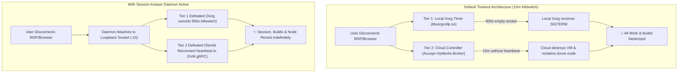

# [Follow-up] Reverse-Engineering JioPC: Native Terminal Access (No Hotkeys) & Defeating the 15-Minute Disconnect Killswitch Permanently

Hey r/developersIndia,

Two weeks ago, I posted a [technical breakdown and whitepaper](https://www.reddit.com/r/developersIndia/comments/1w6j24a/reverseengineering_jiopc_whats_actually_under_the/) analyzing what actually powers JioPC under the hood (8-core Intel Xeon Platinum 8370C on Azure, 581 MB/s NFS array, AVX-512 support). 

The response and discussions were amazing. However, since the initial post, two major roadblocks emerged for developers trying to use JioPC as a serious remote workstation:

1. **Terminal Access Was Cut Off**: Jio removed VSCodium and other IDEs from the JioStore GUI catalog. Standard terminals (`gnome-terminal`, `xterm`) are purged, and the common trick of pressing `Alt + F2` fails for anyone connecting from a Linux host (like Fedora/Ubuntu) or Mac because the host OS intercepts the hotkey.
2. **The 15-Minute Disconnect Killswitch**: Disconnecting your client, losing Wi-Fi, or closing the tab for more than 15 minutes terminates your Xorg desktop session and deprovisions the VM node, killing all background builds, servers, and unsaved work. Common fixes like `loginctl enable-linger` or mouse-jiggler scripts do not stop this.

Here is the technical deep-dive into how both mechanisms work, how to get a native GTK terminal using only mouse clicks, and how we completely neutralized the 15-minute killswitch with a zero-root background keeper daemon.

---

## 1. Getting a Native Terminal (100% GUI — Zero Hotkeys, Zero Downloads)

### The Hidden Gem: `pterm` is Already Installed
While Jio removed GUI shortcuts for developer tools, they did not purge the system-wide Flatpak storage (`/var/lib/flatpak/app`). 

Pre-installed inside the system is **PuTTY** (`uk.org.greenend.chiark.sgtatham.putty`). PuTTY includes **`pterm`**—a pure-GTK, standalone X11 terminal emulator. When launched with `-e flatpak-spawn --host bash`, it bypasses the container and attaches directly to an unrestricted host Linux bash shell!

### 30-Second Setup via File Manager (Thunar):
Since hotkeys like `Alt + F2` or `Ctrl + Alt + T` get trapped by host operating systems, use this mouse-only method:

1. Open **File Manager** (double-click "Computer" or "Downloads" on the desktop).
2. In the top menu bar, click: **`Edit` → `Configure custom actions...`**.
3. Click the **`+`** (Add) button on the right.
4. In the **Basic** tab:
   - **Name**: `Terminal`
   - **Command**: 
     ```bash
     flatpak run --command=pterm uk.org.greenend.chiark.sgtatham.putty -e flatpak-spawn --host bash
     ```
5. In the **Appearance Conditions** tab:
   - Check **Directories** (or leave all checked).
6. Click **OK**, then **Close**.

👉 **You're done!** Right-click anywhere inside the File Manager and click **`Terminal`**. A native GTK terminal window immediately launches.

*(Optional)* Once your terminal is open, run this one-liner to put a permanent **Terminal** icon right on your Desktop:
```bash
cat << 'EOF' > ~/Desktop/terminal.desktop
[Desktop Entry]
Version=1.0
Name=Terminal
Exec=flatpak run --command=pterm uk.org.greenend.chiark.sgtatham.putty -e flatpak-spawn --host bash
Icon=utilities-terminal
Type=Application
EOF
chmod +x ~/Desktop/terminal.desktop
```

---

## 2. Reverse-Engineering the 15-Minute Disconnect Killswitch

Many users noticed that even with `loginctl enable-linger` active, disconnecting RDP for 15 minutes caused the session to vanish. Dissecting the binaries revealed why: JioPC implements a **Dual-Tier Timeout Architecture**.



### Tier 1: Local Xorg Killswitch (`libxorgxrdp.so`)
- When client TCP drops, `/var/run/xrdp/<UID>/xrdp_display_10` goes idle.
- `libxorgxrdp.so` arms an internal timer: `rdpDeferredDisconnectCallback` set to `XRDP_SESMAN_MAX_DISC_TIME` (**900 seconds / 15 minutes**).
- If no client connects before 900 seconds, it issues `kill(getpid(), SIGTERM)` to terminate Xorg.
- **The Catch**: Simply sending raw bytes to the socket crashes Xorg. It requires completing the official 26-byte `XR_MSG_VERSION` and `XR_MSG_INVALIDATE` protocol handshake.

### Tier 2: Cloud Controller Deprovisioning (Accops HyWorks Broker)
- Even if you patch local Xorg, the VM gets destroyed from the outside!
- Reverse-engineering `/usr/local/lib/libagentcommunication.so` and `EDC.Platform.DVMModels.dll` revealed that `/usr/local/sbin/xrdp` calls the local Desktop Virtualization Manager over a UNIX socket at `/run/accops/dvm/grpc.sock`.
- On disconnect, it emits `SendSessionChange(sessionstate=2)` (`Disconnect`).
- The cloud broker starts a 15-minute countdown. If no reconnect event is received, the cloud API destroys the VM instance and releases the compute node back to the pool.
- **The Vulnerability**: `/run/accops/dvm/grpc.sock` is world-writable (`0666`), meaning **any non-root user process can talk to it directly via gRPC!**

### Bonus Gotcha: The Pointer Freeze Trap
When reconnecting after a resize or disconnect, `xfwm4` (the window manager) often gets stuck in an active pointer grab (`device frozen, state 6`), and leaves an invisible full-screen `InputOnly` window mapped over the screen. This causes mouse clicks and scrolling to completely stop working inside the VM until the window manager state is cleanly sanitized.

---

## 3. The Solution: Dual-Tier Session Keeper (Zero Sudo Required)

We packaged these findings into an autonomous, user-space daemon that runs entirely under `systemd --user`:

👉 **GitHub Repository**: [https://github.com/sys-dissect/jiopc-session-keeper](https://github.com/sys-dissect/jiopc-session-keeper)

### How It Works:
1. **Passive Standby**: While you are actively connected, the daemon stays idle and never interferes with your real RDP connection.
2. **Tier 1 Defeat**: The moment you disconnect, it detects the empty socket within 1 second, attaches a loopback connection to `xrdp_display_10`, sends the 26-byte handshake, and holds the socket open. Xorg logs: `"disengaging disconnect timer"`.
3. **Tier 2 Defeat**: It issues `SendSessionChange(sessionstate=1)` (`Reconnect`) to `/run/accops/dvm/grpc.sock` immediately upon disconnect, and repeats it every 60 seconds as a heartbeat. The cloud broker believes you are actively reconnected.
4. **Seamless Yield**: The second your real RDP client reconnects, Xorg drops the keeper's loopback socket. The keeper catches `EOF`, immediately steps aside, sanitizes pointer grabs, and refreshes `xfwm4` so mouse clicks and scrolling work instantly.
5. **Idle Screen Lockout Prevention**: Every 30 seconds while connected, it pokes `/var/run/xrdp/<UID>/xrdp_idle_timeout_data_flow_*` with `sound_playing` to stop the screen from blanking or locking.

---

## 4. How to Install & Test

Once you open a terminal (via the Thunar method above), install with one command:

```bash
git clone https://github.com/sys-dissect/jiopc-session-keeper.git
cd jiopc-session-keeper && ./install.sh
```

### How to Verify It Works:
1. Leave your terminal, code, or a long-running command running.
2. Close your RDP client / browser tab.
3. Set a timer on your phone for **25 to 30 minutes** (well past the 15-minute killswitch).
4. Reconnect — your session, windows, and running processes will be right where you left them!
5. Check daemon logs:
   ```bash
   tail -n 30 ~/.local/state/session-keeper.log
   ```

---

## Summary & Code

The entire codebase is open-source, non-root, and audited for zero PII:
- **Repo**: [https://github.com/sys-dissect/jiopc-session-keeper](https://github.com/sys-dissect/jiopc-session-keeper)
- Tested on: JioPC Enterprise (8-vCPU Intel Xeon Platinum 8370C, Ubuntu 22.04 LTS).

If you are using JioPC for development, testing, or cloud builds, test this on your instance and let us know your experience in the comments or on GitHub!
